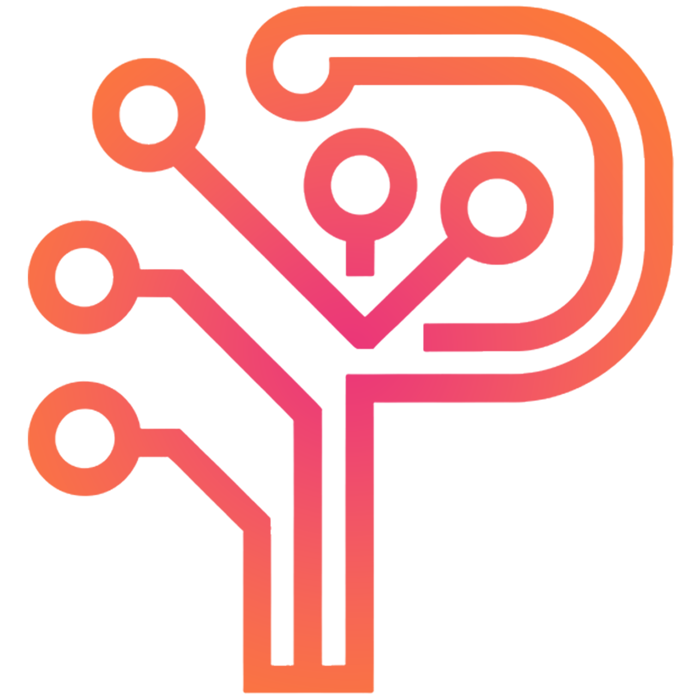

<div align="center">
   <div style="display: flex; padding-block: 40px; margin-bottom: 20px; background-color: #1f1f1f">
      <picture>
         <source media="(prefers-color-scheme: dark)" srcset="./logos/Logo.png">
         <source media="(prefers-color-scheme: light)" srcset="./logos/Logo.png">
         
      </picture>
   </div>
</div>

# [LinkTree](https://linktree.pivi.dev/)

A personal portfolio and link aggregator built with Vue 3, TypeScript, and GSAP. Features a dark-themed UI with gradient accents, 3D card interactions, scroll-triggered animations, and i18n support (English/Italian).

       

## Tech Stack

- **Framework**: Vue 3 (Composition API + `<script setup>`)
- **Language**: TypeScript
- **Styling**: SCSS with design tokens (variables/mixins)
- **Animations**: GSAP + ScrollTrigger
- **Fonts**: Plus Jakarta Sans (body), Playfair Display (headings)
- **i18n**: vue-i18n (EN/IT)
- **Build**: Vite
- **Package Manager**: pnpm

## Project Structure

```text
.
├── logos/              # Brand assets
└── linktree/           # Vue 3 app
    └── src/
        ├── assets/     # SVG icons and flag images
        ├── components/ # Atomic design (atoms → molecules → organisms → templates → pages)
        ├── data/       # Project data definitions
        ├── i18n/       # Locale files (en, it)
        ├── router/     # Vue Router config
        └── styles/     # SCSS variables, mixins, global styles
```

## Getting Started

```bash
git clone https://github.com/thisispivi/LinkTree.git
cd linktree
pnpm i
pnpm dev
```

## Deployment

```bash
cd linktree
pnpm run deploygh
```
